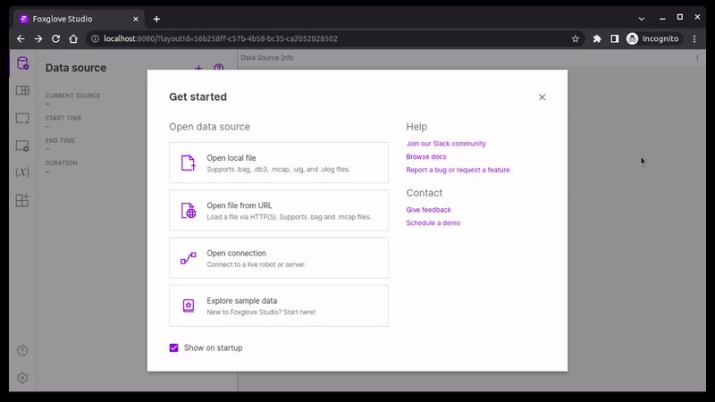

# Foxglove Tools

## Overview

This repository contains various plugins and utilities for the [foxglove studio](https://foxglove.dev/) visualization platform:

- **Foxglove Web** &mdash; web version of foxglove with some [QOL patches](https://github.com/foxglove/studio/discussions/4823) (unfortunately foxglove owners don't seem to be interested in implementing them)
- **CartPole Panel** &mdash; visualization for the [cart-pole](https://github.com/robotics-laboratory/cart-pole) project
- **Live Stream Panel** &mdash; real-time video streaming for the [truck](https://github.com/robotics-laboratory/truck) project
- **Serivce Button Panel** &mdash; simple button widget that calls specified ROS service

## Quick Start

Select one of the following commands that matches your architecture. Web server port can be set via `FOXGLOVE_PORT` environment variable (default: `8080`).

```
docker compose up --no-build foxglove-amd64  # amd64
docker compose up --no-build foxglove-arm64  # arm64/v8 (aarch64)
```

Navigate to [http://localhost:8080/]() to open foxglove web interface. Then open extensions menu and click on a cloud icon at the top. Custom extensions then should be installed (or reloaded).



## Building

To build for multiple architectures, use [docker buildx](https://docs.docker.com/build/building/multi-platform/). To test image locally before pushing, replace `--push` flag with `--load`.

```
docker buildx bake -f docker-compose.yaml --push
```
